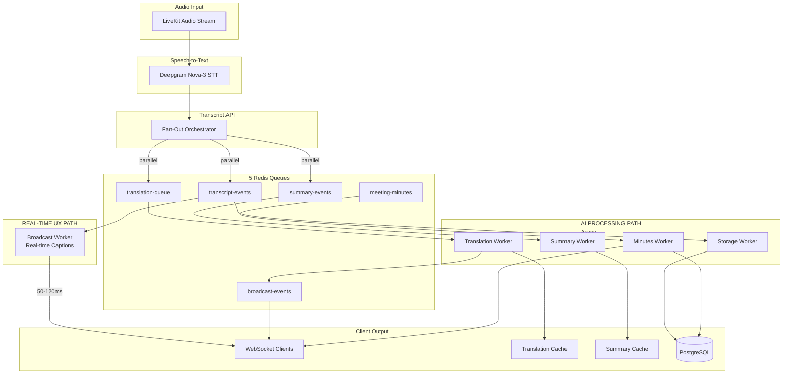
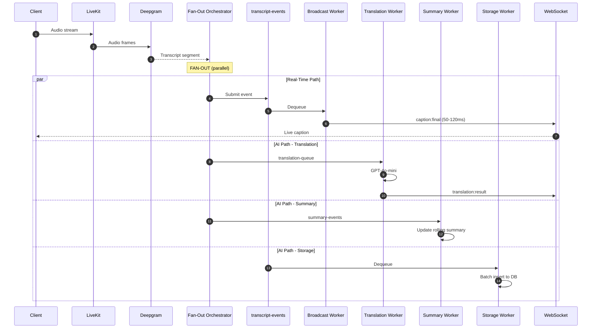
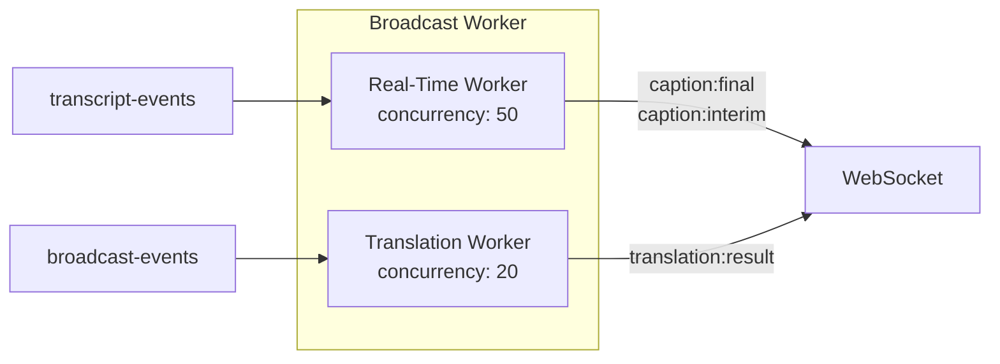
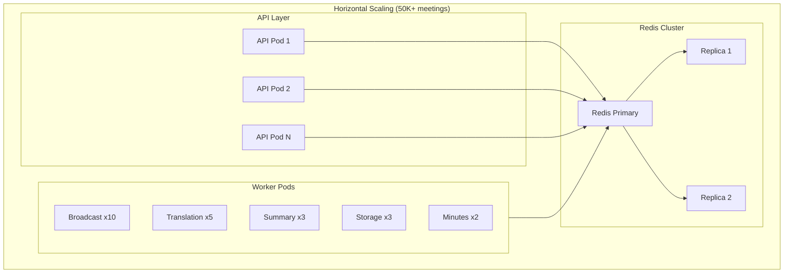

# AI Meeting Pipeline Architecture

## Overview

This document describes the distributed AI meeting pipeline architecture designed for **50K+ concurrent meetings** with <120ms caption latency.

**Key Principle: Real-time UX path ≠ AI processing path**

## High-Level Architecture



## Pipeline Flow

```
Audio (LiveKit)
        ↓
Deepgram STT
        ↓
Transcript API (Fan-Out Orchestrator)
        ↓
Redis Stream (transcript-events)
        │
        ├─ Broadcast Worker ──────► WebSocket Clients (50-120ms)
        │      [REAL-TIME PATH]
        │
        ├─ Translation Worker ────► Redis Translation Cache
        │      [AI PATH]              ↓
        │                         broadcast-events → WebSocket
        │
        ├─ Storage Worker ────────► Database
        │      [AI PATH]
        │
        └─ Summary Worker ────────► Incremental Summary Cache
               [AI PATH]

Meeting End Event
        ↓
Minutes Worker (meeting-minutes queue)
        ↓
Final Minutes + Action Items
```

## 5 Redis Queues

| Queue | Purpose | Path | Priority |
|-------|---------|------|----------|
| `transcript-events` | Fan-out source for all transcripts | Real-time | Highest |
| `translation-queue` | AI translation jobs | AI | Medium |
| `broadcast-events` | Translation results for clients | AI | Medium |
| `summary-events` | Incremental summarization | AI | Low |
| `meeting-minutes` | Final minutes generation | AI | Low |

## Real-Time vs AI Processing Paths

### Real-Time UX Path (50-120ms)
```
transcript-events → Broadcast Worker → caption:final/caption:interim → Clients
```
- **Purpose**: Deliver captions to users immediately
- **Latency target**: 50-120ms end-to-end
- **No AI blocking**: Does NOT wait for translation
- **Concurrency**: 50+ workers per instance

### AI Processing Path (Async)
```
translation-queue → Translation Worker → broadcast-events → Clients
summary-events → Summary Worker → Summary Cache
storage-worker → Database
```
- **Purpose**: AI-powered features (translation, summary)
- **Latency**: 500ms-3s acceptable
- **Decoupled**: Does not block real-time captions

## Sequence Diagram



## Worker Architecture

### Broadcast Worker (Dual-Path)


### Translation Worker
- Circuit breaker pattern
- 15s timeout with fallback to Google Translate
- L1/L2 caching (memory + Redis)
- Dead letter queue for failures

### Summary Worker
- Incremental summarization every 10 segments
- Rolling summary cache in Redis
- GPT-4o-mini for chunk summaries
- Batched processing (not every segment)

### Storage Worker
- Batches writes for efficiency
- 50 transcripts per batch OR 1s timeout
- Only stores final transcripts
- Handles meeting flush on end

### Minutes Worker
- Triggered on meeting end
- Retrieves all transcripts from DB
- Chunks large transcripts (>4K tokens)
- GPT-4o for final summary merge
- Extracts action items

## Scaling Configuration



### Recommended Scaling

| Component | Per 10K Meetings | Notes |
|-----------|------------------|-------|
| API Pods | 5-10 | Stateless, scales with load balancer |
| Broadcast Workers | 10-20 | High concurrency (50 each) |
| Translation Workers | 5-10 | GPT rate limited |
| Summary Workers | 3-5 | Batched, lower throughput |
| Storage Workers | 3-5 | DB connection limited |
| Minutes Workers | 2-3 | End-of-meeting only |

## Latency Breakdown

| Stage | Target | Notes |
|-------|--------|-------|
| Deepgram STT | 30-50ms | Real-time streaming |
| Fan-Out Orchestrator | <10ms | Parallel queue submits |
| Broadcast Worker | <20ms | Socket.IO emit |
| **Total Caption** | **50-120ms** | Real-time path |
| Translation | 200-500ms | GPT-4o-mini |
| Summary Update | 1-3s | Batched |

## File Structure

```
apps/api/src/
├── services/pipeline/
│   ├── fanOutOrchestrator.ts   # NEW: Main entry point
│   ├── orchestrator.ts         # Legacy (backward compat)
│   ├── chunking.ts
│   ├── metrics.ts
│   ├── chunkedSummarization.ts
│   └── index.ts
├── workers/
│   ├── broadcast.worker.ts     # Dual-path: real-time + translation
│   ├── translation.worker.ts   # Circuit breaker, timeout, DLQ
│   ├── summary.worker.ts       # NEW: Incremental summaries
│   ├── storage.worker.ts       # NEW: Batched DB writes
│   ├── minutes.worker.ts
│   └── index.ts
├── queues/
│   ├── transcriptEvents.queue.ts  # NEW: Fan-out source
│   ├── translation.queue.ts       # NEW: AI translation
│   ├── summaryEvents.queue.ts     # NEW: Incremental summary
│   ├── broadcast.queue.ts
│   └── minutes.queue.ts
└── infrastructure/
    └── redisClient.ts
```

## Performance Targets

| Metric | Target | Architecture Support |
|--------|--------|---------------------|
| Caption latency | 50-120ms | Direct real-time path |
| Concurrent meetings | 50K+ | Horizontal scaling |
| Translation throughput | 1000/s | Worker pools |
| Summary updates | Every 10 segments | Batching |
| Minutes generation | <30s | Chunking + parallel |
